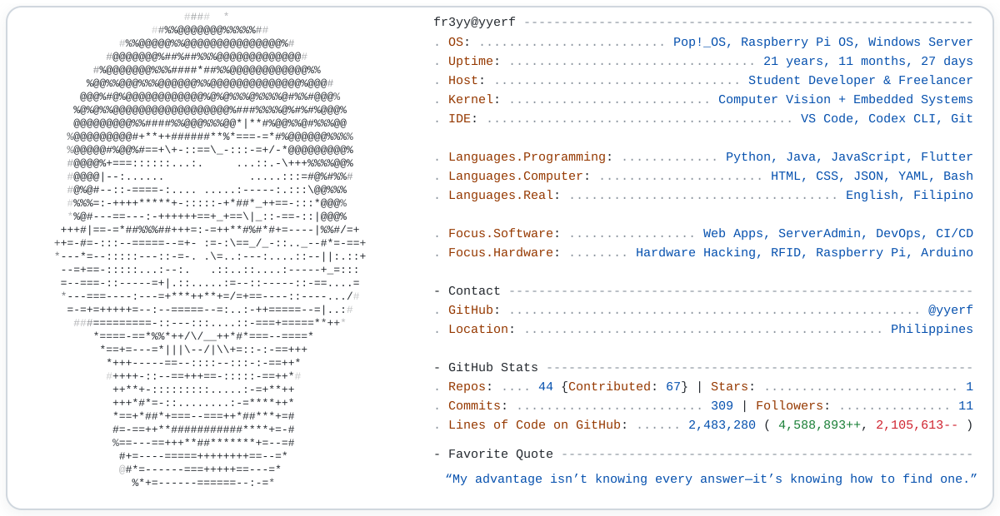

<!-- ========================================= -->
<!-- Terminal-style ASCII profile card         -->
<!-- ========================================= -->

<picture>
  <source
    media="(prefers-color-scheme: dark)"
    srcset="./dark_mode.svg"
  />
  <source
    media="(prefers-color-scheme: light)"
    srcset="./light_mode.svg"
  />
  
</picture>

<!-- ========================================= -->
<!-- Profile views                             -->
<!-- ========================================= -->

  

<!-- ========================================= -->
<!-- Typing introduction                       -->
<!-- ========================================= -->

  

<!-- ========================================= -->
<!-- Original contribution snake               -->
<!-- Kept exactly in its original/default form -->
<!-- ========================================= -->

<picture>
  <source
    media="(prefers-color-scheme: dark)"
    srcset="https://raw.githubusercontent.com/tobiasmeyhoefer/tobiasmeyhoefer/output/github-snake-dark.svg"
  />
  <source
    media="(prefers-color-scheme: light)"
    srcset="https://raw.githubusercontent.com/tobiasmeyhoefer/tobiasmeyhoefer/output/github-snake.svg"
  />
  
</picture>

<!-- ========================================= -->
<!-- Professional social links                 -->
<!-- ========================================= -->

<h3 align="center">Connect with me</h3>

  &nbsp;&nbsp;&nbsp;&nbsp;
  &nbsp;&nbsp;&nbsp;&nbsp;
  &nbsp;&nbsp;&nbsp;&nbsp;
  

